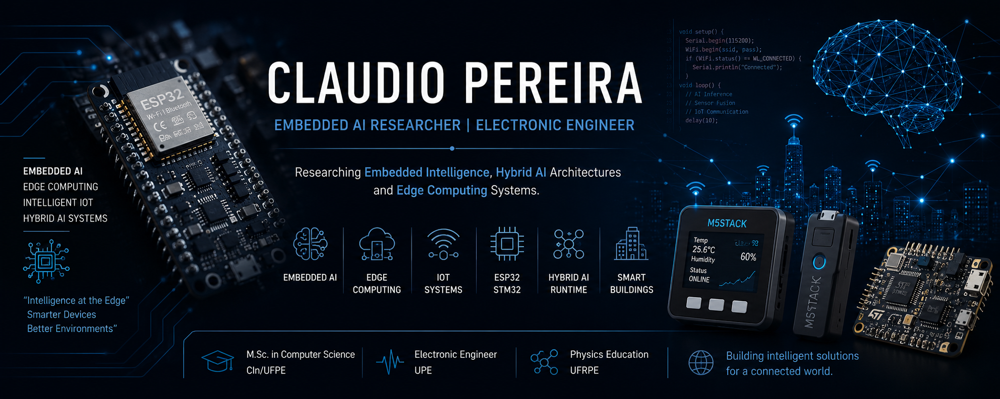

# Claudio Pereira

### Embedded AI • Edge Computing • Intelligent IoT

Embedded AI Researcher | Electronic Engineer | IoT & Hybrid AI Architectures

Researching Embedded Intelligence, Hybrid AI Architectures and Edge Computing Systems.

---

## About Me

M.Sc. in Computer Science from CIn/UFPE with multidisciplinary experience in Embedded Systems, Embedded AI, IoT architectures, Edge Computing and intelligent connected devices.

Background in:

* Electronic Engineering
* Embedded Systems
* Hybrid AI Architectures
* IoT Solutions
* Edge Intelligence
* Intelligent Gateways
* TinyML & Local LLM Experiments

---

## Research & Technical Interests

* Embedded Systems
* Edge AI
* Hybrid AI Runtime
* ESP32 / STM32 Platforms
* IoT Architectures
* LoRa / Zigbee Networks
* TinyML
* Local LLM Inference
* Smart Buildings
* Intelligent Gateways

---

## Current Research

* Hybrid AI architectures for constrained devices
* Local LLM inference experiments
* Embedded runtime systems
* ESP32 + AI integration
* Edge intelligence for smart environments
* Intelligent IoT gateways

---

## Featured Technologies

---

## Academic Background

* M.Sc. in Computer Science — CIn/UFPE
* B.Sc. in Electronic Engineering — UPE
* Physics Education Degree — UFRPE

---

## Featured Projects

### Hybrid AI Runtime

Runtime architecture for constrained intelligent devices.

### ESP32 + LLM Experiments

Experiments integrating embedded systems with local AI inference.

### Intelligent IoT Gateways

Research on edge intelligence and distributed IoT architectures.

### Smart Building Research

IoT and intelligent sensing architectures for smart environments.

---

## Research Focus

- Embedded AI
- Hybrid AI Runtime
- Edge Computing
- Intelligent IoT Systems
- Embedded Linux
- ESP32 / STM32 Platforms
- Local AI Inference
  
---

## Contact

* GitHub: https://github.com/profclaudiopereira
* GitHub Pages: https://profclaudiopereira.github.io
